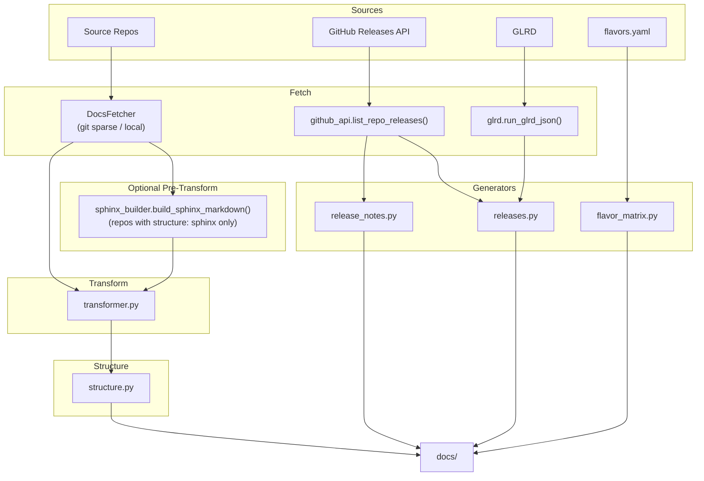

# Documentation Aggregation Architecture

Deep dive into the design and implementation of the documentation aggregation
system.

## System Overview

We use a documentation aggregation pipeline that combines content from multiple
source repositories into a unified VitePress documentation site.



## Core Components

### 1. Fetch Stage (`fetcher.py`)

**Purpose:** Retrieve documentation from source repositories

**Mechanisms:**

- **Git Sparse Checkout:** For remote repositories, uses sparse checkout to
  fetch only the `docs/` directory, minimizing clone size
- **Local Copy:** For `file://` URLs, performs direct filesystem copy without
  git operations
- **Commit Resolution:** Records the resolved commit hash for locking

**Key Features:**

- Supports both remote (git) and local (file) sources
- Handles root files separately from docs directory
- Provides commit hash for reproducible builds

### 2. GitHub HTTP client (`github_api.py`)

**Purpose:** Fetch GitHub release data for use by the release generators.

Uses `GITHUB_TOKEN` when set. Hard-fails on any error (network, non-2xx status,
rate-limit exhaustion, or empty first page) so release docs never ship in a
silently degraded state.

### 3. GLRD subprocess wrapper (`glrd.py`)

**Purpose:** Query active minor-release versions and release metadata from the
`glrd` command-line tool. The data drives the release-table generator.

Returns `None` on any failure rather than raising exceptions.

### 4. Sphinx Markdown builder (`sphinx_builder.py`)

**Purpose:** Produce plain Markdown output from Sphinx-based documentation so
it can be consumed by VitePress through the normal aggregation pipeline.

Invokes `python -m sphinx -M markdown` on a fetched repository and copies the
resulting Markdown into the aggregation output directory. Called only for repos
configured with `"structure": "sphinx"` in `repos-config.json`. Requires
`sphinx`, `sphinx-markdown-builder`, and any project-specific Sphinx extensions
installed in the same Python environment as the aggregator.

### 5. Transform Stage (`transformer.py`)

**Purpose:** Modify content to work in the aggregated site

**Transformations:**

1. **Link Rewriting:** Transform relative links to work across repository
   boundaries
   - Links that escape the docs tree via `../`: Redirected to GitHub
   - Absolute `/` links: Redirected to GitHub
   - Relative and `./` links: Left unchanged for VitePress to resolve natively
   - External links: Preserved as-is

2. **Front-matter Handling:** Ensure all documents have proper front-matter
   - Add missing front-matter blocks
   - Quote YAML values safely
   - Preserve existing metadata

### 6. Structure Stage (`structure.py`)

**Purpose:** Organize documentation into the final directory structure

**Operations:**

1. **Targeted Documentation:** Copy files with `github_target_path` to specified
   locations
2. **Internal Link Verification:** Fail aggregation if any shipped file links
   to a source-repo file that was not itself shipped (hard-fail to catch
   unmigrated links early)
3. **Media Copying:** Discover and copy media directories
4. **Markdown Processing:** Apply front-matter fixes to all copied files

### 7. Release-table generator (`releases.py`)

**Purpose:** Build the release-status table from GLRD data, filtered against
fetched GitHub tags.

GLRD-listed rows that carry a `minor` version component are only emitted when
their normalized version string (`{major}.{minor}[.{patch}]`, leading `v`
stripped) appears in the fetched GitHub tag set. Major-only rows are always
emitted. Each skipped row logs a one-line warning to `stderr`.

### 8. Per-release notes generator (`release_notes.py`)

**Purpose:** Write one Markdown page per pre-fetched GitHub release. Makes no
network calls; accepts the release list returned by
`github_api.list_repo_releases()`.

### 9. Flavor matrix generator (`flavor_matrix.py`)

**Purpose:** Generate flavor matrix documentation from `flavors.yaml` and
feature metadata. Parses `flavors.yaml` directly using the Garden Linux
`FlavorsParser` and `FeaturesParser` classes.

## Key Mechanisms

### Targeted Documentation

Files with `github_target_path` front-matter are copied directly to their
specified location:

```yaml
---
github_target_path: "docs/how-to/example.md"
---
```

**Flow:**

1. Scan all markdown files for `github_target_path`
2. Create target directory structure
3. Copy file to exact specified location
4. Apply markdown transformations

This allows fine-grained control over where content appears in the final site.
All source-repo files that are not tagged with `github_target_path` are
excluded from the built site entirely.

### Media Directory Handling

Media directories are automatically discovered and copied:

**Nested Media:**

- Location: `tutorials/assets/`
- Copied to: `docs/tutorials/assets/`
- Rationale: Preserve relative paths for tutorial-specific media

**Root-Level Media:**

- Location: `_static/`, `.media/`
- Copied to: Common ancestor of all targeted files
- Rationale: Shared media available to all documents

### Commit Locking

For reproducible builds, commits can be locked:

```json
{
  "name": "repo",
  "ref": "main",
  "commit": "abc123..."
}
```

**Benefits:**

- Reproducible documentation builds
- Stable CI/CD pipelines
- Version control for aggregated docs

**Update Process:**

```bash
make aggregate-update
```

This fetches the latest from `ref` and updates commit locks.

## Design Decisions

### Why Git Sparse Checkout?

- **Efficiency:** Only fetches docs directory, not entire repository
- **Speed:** Faster than full clone, especially for large repos
- **Minimal Disk Usage:** Reduces storage requirements

### Why Front-Matter-Based Targeting?

- **Flexibility:** Authors control where their docs appear
- **Decentralization:** No central mapping file to maintain
- **Explicit:** Clear indication in source files of their destination

### Why Separate Fetch/Transform/Structure?

- **Modularity:** Each stage has single responsibility
- **Testability:** Easy to test individual stages
- **Extensibility:** New transformations added without affecting fetch/structure

## Data Flow

### Repository → Temporary Directory

```
Source Repo                    Temp Directory
├── docs/                  →   /tmp/xyz/repo-name/
│   ├── tutorials/             ├── tutorials/
│   ├── how-to/                ├── how-to/
│   └── reference/             └── reference/
├── README.md              →   README.md (if in root_files)
└── src/                       (not copied)
```

### Temporary Directory → Docs Output

```
Temp Directory                 Docs Output
/tmp/xyz/repo-name/        →
├── tutorials/                 docs/
│   └── guide.md                   ├── tutorials/
│       (github_target_path)       │   └── guide.md (targeted)
├── how-to/                        └── how-to/
└── reference/                         (targeted files only)
```

## Performance Characteristics

### Fetch Stage

- **Git sparse:** O(docs_size) + network latency
- **Local copy:** O(docs_size) filesystem I/O

### Transform Stage

- **Link rewriting:** O(n \* m) where n = files, m = avg file size
- **Front-matter:** O(n) single pass through files

### Structure Stage

- **Targeted copy:** O(n) where n = files with github_target_path
- **Link verification:** O(n \* l) where l = avg links per file
- **Media copy:** O(m) where m = media files

### Overall

- Dominated by git network operations for remote repos
- Filesystem I/O bound for local repos
- Typically completes in seconds for typical documentation repos

## Error Handling

### Fetch Failures

- Invalid git URL → Clear error message with URL
- Network issues → Retry with exponential backoff
- Missing docs_path → Warning, skip repository

### Transform Failures

- Invalid front-matter → Add default front-matter, log warning
- Broken links → Log warning, preserve original link
- Invalid markdown → Process as best-effort, log error

### Structure Failures

- Missing target directory → Create automatically
- Conflicting file paths → Error with clear message
- Media directory not found → Log warning, continue

### GitHub API Failures

Any GitHub API failure during release pre-fetch (network, non-2xx status,
rate-limit exhaustion, or empty result) is fatal. This prevents shipping
silently degraded release documentation. See
[GitHub API token](./working-locally.md#github-api-token) for token setup.

## Related Topics

<RelatedTopics />
