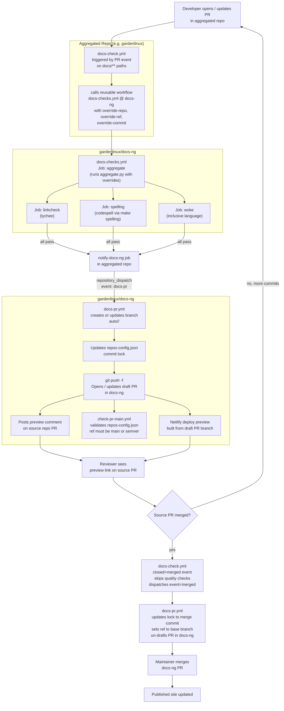
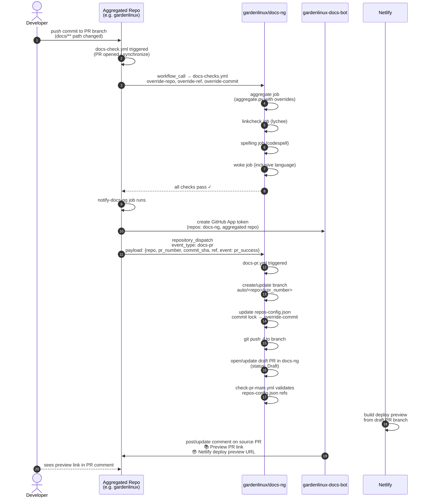
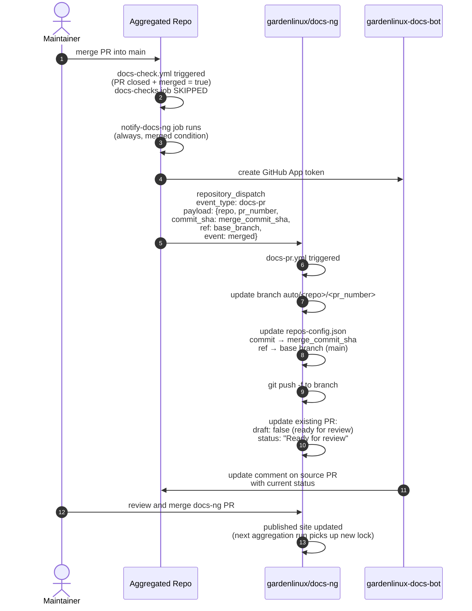
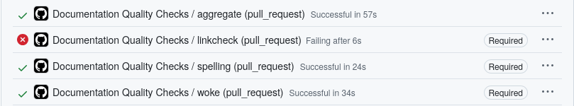
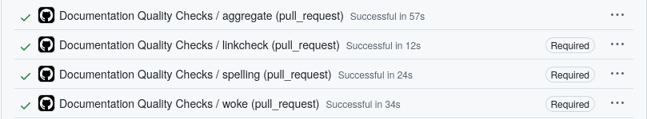
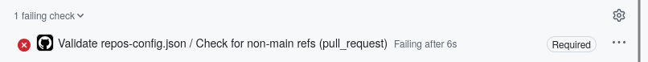

# Documentation CI Architecture

## Purpose

The documentation CI pipeline serves three guarantees:

1. **Quality**: every documentation change in any aggregated repository is
   validated for broken links, spelling errors, and inclusive language _before_
   it can influence the published site.
2. **Preview**: contributors and reviewers can inspect exactly how a pull
   request's documentation changes will look on the live site, via a Netlify
   deploy preview attached to an automated draft PR in `docs-ng`.
3. **Always latest docs**: once a PR of an aggregrated repository (source PR) is merged, the `repos-config.json`
   commit lock for that repository is automatically updated so the published
   site reflects the latest content without any manual intervention.

These three properties are implemented by four GitHub Actions workflows that
span two repository boundaries. See [CI Workflows Reference](./ci-workflows-reference.md)
for the per-workflow details.

## Actors and Repositories

### [`gardenlinux/docs-ng`](https://github.com/gardenlinux/docs-ng)

The central aggregation hub. It hosts:

- The reusable quality-checks workflow ([`docs-checks.yml`](https://github.com/gardenlinux/docs-ng/blob/main/.github/workflows/docs-checks.yml)), which can be
  called from any aggregated repo.
- The automated PR workflow ([`docs-pr.yml`](https://github.com/gardenlinux/docs-ng/blob/main/.github/workflows/docs-pr.yml)), which creates and maintains draft
  PRs in `docs-ng` when aggregated repos signal a documentation change.
- The config validator workflow ([`check-pr-main.yml`](https://github.com/gardenlinux/docs-ng/blob/main/.github/workflows/check-pr-main.yml)), which guards `main`
  against non-production refs in [`repos-config.json`](https://github.com/gardenlinux/docs-ng/blob/main/repos-config.json).
- The [`repos-config.json`](https://github.com/gardenlinux/docs-ng/blob/main/repos-config.json) file that records which repo and which exact commit
  is currently published.

### Aggregated repositories

Each repository listed in `repos-config.json` contains `docs-check.yml` workflow that:

- reacts to pull request and push events on documentation-relevant paths,
- calls the reusable `docs-checks.yml` from `docs-ng`, passing the PR's
  branch and commit as override inputs, and
- on success (or on merge), dispatches a `repository_dispatch` event to
  `docs-ng` to trigger the automated PR workflow.

### `gardenlinux-docs-bot` GitHub App

A GitHub App with write access to both `docs-ng` and the aggregated repositories.
It's responsible for generating short-lived tokens that allow cross-repository API calls without using a personal access token, opening and updating draft PRs in `docs-ng` and posting comments back to the PRs in the aggregated repo which include links to the Netlify preview.

Required secrets (configured in each aggregated repository):

| Secret | Purpose |
|--------|---------|
| `DOCS_BOT_APP_ID` | Identifies the GitHub App |
| `DOCS_BOT_PRIVATE_KEY` | Signs the JWT used to obtain installation tokens |

### Netlify

`docs-ng` has a [Netlify](https://www.netlify.com/) integration that automatically creates a deploy preview
for every open PR. The `docs-pr.yml` workflow posts the preview URL as a
comment on the originating aggregated repo PR so reviewers do not have to navigate
to `docs-ng` manually.

## Build Flow

The diagram below shows the path from a documentation change in an aggregated
repository through to a merged commit lock update in `docs-ng`.



## CI Flow Scenarios

### **Scenario A**: PR opened or synchronized in an aggregated repo

The following diagram shows the event sequence when a contributor opens a new
PR (or pushes additional commits to an open PR) in an aggregated repository.
The sequence assumes the aggreagred repository already has `docs-check.yml`
installed and the docs-related path filter matches.



### Scenario B — Source PR merged

When the source PR is merged, `docs-check.yml` fires again with
`action: closed` and `merged: true`. The quality checks are skipped; only the
notification job runs to promote the draft docs-ng PR to ready-for-review.



## Failure Modes

The following scenarios describe what can go wrong and where the failure will
be visible.

### Quality checks fail in the aggregated repo

If any of the `linkcheck`, `spelling`, or `woke` jobs in `docs-checks.yml`
fail, the `notify-docs-ng` job in `docs-check.yml` does **not** run (the
`needs: [docs-checks]` condition `result == 'success'` is not met). No
dispatch event is sent to `docs-ng`, and no draft PR is created or updated.

The failure is visible as a failed status check directly on the aggregated repo PR.





### Draft PR not created / not updated

If the `docs-pr.yml` workflow fails (e.g., because the GitHub App token cannot
be obtained, or because the `repos-config.json` entry for the aggregated repo does
not exist), no draft PR is opened and no comment is posted.

Check the `docs-pr.yml` run in the **Actions** tab of `docs-ng` for the error.

### `check-pr-main.yml` blocks the docs-ng PR

If the docs-ng draft PR's `repos-config.json` still contains a non-`main`,
non-semver `ref` when someone tries to merge it to `main`, `check-pr-main.yml`
will fail and prevent the merge. This happens if the source PR was never
merged (the draft PR still points at a feature branch ref).

The fix is to either wait for the source PR to be merged (which will update the
ref to `main`) or to close the draft PR if the source PR was abandoned.

<!-- TODO(screenshot): docs-ng PR with check-pr-main.yml failing due to non-main ref -->


### Netlify preview not available

Netlify deploy previews are only triggered when the draft PR is open. If the
preview build fails, reviewers can still validate locally:

```bash
make aggregate-local   # uses repos-config.local.json with file:// URLs
make dev               # start local VitePress server
```

See [Working Locally](./working-locally.md) and [Testing](./testing.md) for
details.

## Where to Look When Something Breaks

| Symptom | Where to look |
|---------|--------------|
| aggregatated-repo (source) PR missing docs status check | **Actions** tab of the aggregated repo → `Documentation Quality Check` run |
| Quality check job details (which lint rule failed) | Expand the failing job step in the aggregated repo Actions run |
| No comment on source PR with preview link | **Actions** tab of `docs-ng` → `Create/Update Docs PR` run; check the `Comment on source PR` step |
| Draft PR in `docs-ng` not created | **Actions** tab of `docs-ng` → `Create/Update Docs PR` run; check `Create or update branch` and `Create or update PR` steps |
| `repos-config.json` ref validation fails | **Checks** tab on the draft PR in `docs-ng` → `Validate repos-config.json` run |
| Netlify preview not building | Netlify dashboard → deploy log for the docs-ng PR branch |
| Bot cannot authenticate | Verify `DOCS_BOT_APP_ID` and `DOCS_BOT_PRIVATE_KEY` secrets are set in the aggregated repository's settings |

## Related Topics

<RelatedTopics />
