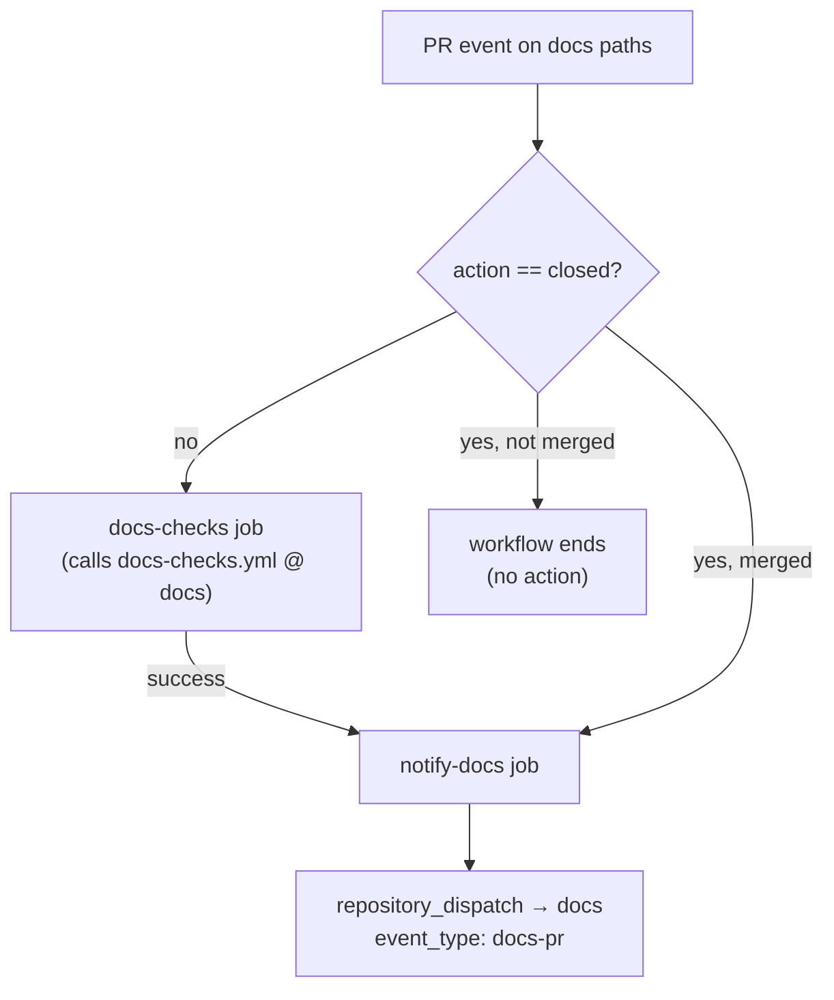
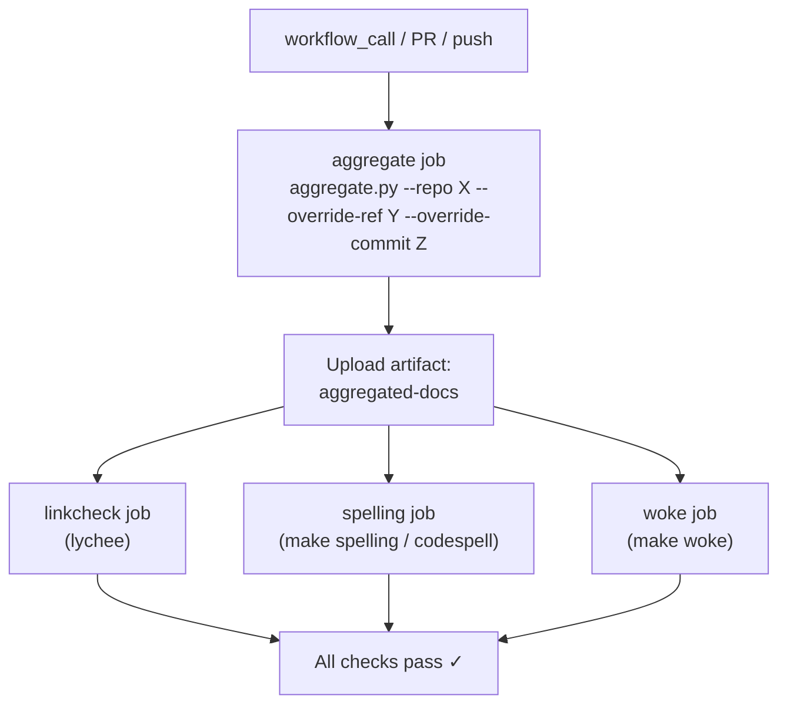
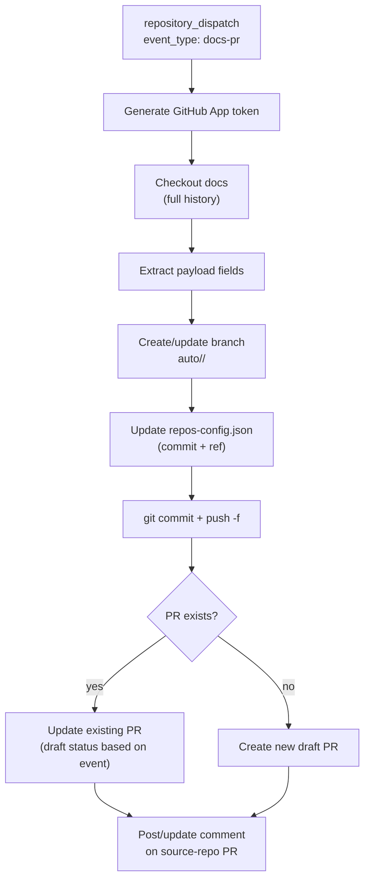
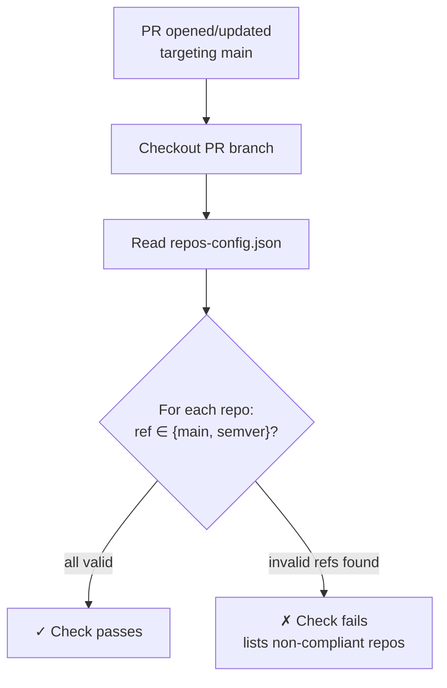

# Documentation CI Workflows Reference

## 1. `docs-check.yml` — Per-Repo Caller Workflow

|              |                                                                         |
| ------------ | ----------------------------------------------------------------------- |
| **File**     | `.github/workflows/docs-check.yml`                                      |
| **Lives in** | Each aggregated repository                                              |
| **Type**     | Caller workflow — invokes the reusable `docs-checks.yml` from `docs` |

### Triggers

```yaml
on:
  pull_request:
    branches: [main]
    types: [opened, synchronize, reopened, closed]
    paths:
      - "docs/**"
      - "features/*/README.md"
      - "features/*/info.yaml"
      - "flavors.yaml"
      - "CONTRIBUTING.md"
      - "SECURITY.md"
  push:
    branches: [main]
    paths:
      # (same path list as above)
```

The workflow reacts to both PR events and pushes on documentation-relevant
paths. The `closed` PR type is intentionally included so the notification job
can detect merged PRs.

### Jobs

| Job              | Condition                                                                         | Purpose                                                                     |
| ---------------- | --------------------------------------------------------------------------------- | --------------------------------------------------------------------------- |
| `docs-checks`    | Skipped when `action == 'closed'`                                                 | Calls the reusable quality-check workflow in `docs` with override inputs |
| `notify-docs` | Runs after `docs-checks` succeeds **or** when a PR is merged (always-conditional) | Generates a GitHub App token and sends a `repository_dispatch` to `docs` |

### Inputs Passed to Reusable Workflow

| Input             | Value                                                     |
| ----------------- | --------------------------------------------------------- |
| `override-repo`   | Hard-coded repository name (e.g., `gardenlinux`)          |
| `override-ref`    | `github.head_ref` (PR branch) or `github.ref_name` (push) |
| `override-commit` | `pull_request.head.sha` or `github.sha`                   |

### Dispatch Payload Sent to `docs`

```json
{
  "repo": "<repo-name>",
  "pr_number": "<PR number>",
  "commit_sha": "<head SHA or merge commit SHA>",
  "ref": "<head branch (open PR) or base branch (merged PR)>",
  "event": "pr_success | merged"
}
```

### Required Secrets

| Secret                 | Purpose                                                   |
| ---------------------- | --------------------------------------------------------- |
| `DOCS_BOT_APP_ID`      | GitHub App identifier for `gardenlinux-docs-bot`          |
| `DOCS_BOT_PRIVATE_KEY` | Private key used to sign the JWT for App token generation |

### Outputs / Side-Effects

- On open/synchronize PR: calls reusable workflow → on success dispatches
  `docs-pr` event to `docs`.
- On merged PR: skips quality checks, dispatches `docs-pr` event with
  `event: merged` and `ref` set to the base branch.

### Job Graph



### Common Failure Causes

| Symptom                    | Likely cause                                                                                       |
| -------------------------- | -------------------------------------------------------------------------------------------------- |
| `docs-checks` job fails    | Broken links, spelling errors, or woke violations in the documentation change                      |
| `notify-docs` job fails | `DOCS_BOT_APP_ID` or `DOCS_BOT_PRIVATE_KEY` secret missing/invalid; App not installed on `docs` |
| Workflow not triggered     | Changed files do not match the `paths:` filter                                                     |

## 2. `docs-checks.yml` — Reusable Quality Checks Workflow

|              |                                                           |
| ------------ | --------------------------------------------------------- |
| **File**     | `.github/workflows/docs-checks.yml`                       |
| **Lives in** | `gardenlinux/docs`                                     |
| **Type**     | Reusable workflow (`workflow_call`) + own PR/push trigger |

### Triggers

```yaml
on:
  workflow_call:
    inputs:
      override-repo:
        description: "Repository name to override (e.g., gardenlinux)"
        required: false
        type: string
      override-ref:
        description: "Git ref to use for the overridden repo"
        required: false
        type: string
      override-commit:
        description: "Git commit SHA to use for the overridden repo"
        required: false
        type: string
  pull_request:
    branches: [main]
  push:
    branches: [main]
```

When called via `workflow_call`, it validates external repo documentation.
When triggered directly by PR/push in `docs`, it validates the aggregator's
own documentation (with no overrides — all repos use their pinned commits).

### Inputs

| Input             | Required | Description                                           |
| ----------------- | -------- | ----------------------------------------------------- |
| `override-repo`   | no       | Repository name in `repos-config.json` to override    |
| `override-ref`    | no       | Git ref (branch) to check out for the overridden repo |
| `override-commit` | no       | Exact commit SHA to aggregate from                    |

When all three inputs are provided, `aggregate.py` substitutes the pinned
commit in `repos-config.json` with the specified commit, effectively testing
the PR's documentation against the rest of the published site.

### Jobs

| Job         | Depends on  | Runner         | Purpose                                                                  |
| ----------- | ----------- | -------------- | ------------------------------------------------------------------------ |
| `aggregate` | —           | `ubuntu-24.04` | Runs `aggregate.py` with override arguments; uploads `docs/` as artifact |
| `linkcheck` | `aggregate` | `ubuntu-24.04` | Runs lychee link checker on the aggregated `docs/**/*.md`                |
| `spelling`  | `aggregate` | `ubuntu-24.04` | Runs `make spelling` (codespell)                                         |
| `woke`      | `aggregate` | `ubuntu-24.04` | Runs `make woke` (inclusive-language checker)                            |

### Artifacts

| Artifact          | Contents                                 | Retention |
| ----------------- | ---------------------------------------- | --------- |
| `aggregated-docs` | Full `docs/` directory after aggregation | 1 day     |

The artifact is consumed by the three parallel lint jobs (`linkcheck`,
`spelling`, `woke`) to avoid re-running aggregation.

### Required Permissions

No secrets are required by this workflow itself (it only reads public
repositories). When called as a reusable workflow, it inherits the caller's
`GITHUB_TOKEN` permissions (read-only is sufficient).

:::tip `GITHUB_TOKEN`
Setting the `GITHUB_TOKEN` environment variable is recommended to prevent rate limiting.
:::

### Job Graph



### Common Failure Causes

| Symptom               | Likely cause                                                                                                 |
| --------------------- | ------------------------------------------------------------------------------------------------------------ |
| `aggregate` job fails | Invalid `repos-config.json` entry for the overridden repo; commit SHA not reachable; Python dependency issue |
| `linkcheck` job fails | Broken internal or external links in Markdown files; check lychee output for specific URLs                   |
| `spelling` job fails  | Unknown words — add them to the project's codespell dictionary (`.codespell/project-words.txt`)              |
| `woke` job fails      | Non-inclusive language detected — see the woke rule file (`.woke.yml`) for alternatives                      |

## 3. `docs-pr.yml` — Automated Docs PR Workflow

|              |                                                               |
| ------------ | ------------------------------------------------------------- |
| **File**     | `.github/workflows/docs-pr.yml`                               |
| **Lives in** | `gardenlinux/docs`                                         |
| **Type**     | `repository_dispatch` consumer + `workflow_dispatch` (manual) |

### Triggers

```yaml
on:
  repository_dispatch:
    types: [docs-pr]
  workflow_dispatch:
    inputs:
      repo: # required, string
      pr_number: # required, string
      commit_sha: # required, string
      ref: # required, string
      event: # required, choice: [pr_success, merged]
```

The workflow is normally triggered by `repository_dispatch` from a source
repo's `docs-check.yml`. It can also be triggered manually via
`workflow_dispatch` for debugging or re-running a failed automation.

### Dispatch Payload Schema

The `client_payload` (or `inputs` for manual dispatch) must contain:

| Field        | Type   | Description                                                                          |
| ------------ | ------ | ------------------------------------------------------------------------------------ |
| `repo`       | string | Repository name as it appears in `repos-config.json` (e.g., `gardenlinux`)           |
| `pr_number`  | string | PR number in the source repository                                                   |
| `commit_sha` | string | Commit SHA to pin in `repos-config.json`                                             |
| `ref`        | string | Branch name — feature branch for open PRs, base branch (e.g., `main`) for merged PRs |
| `event`      | string | Either `pr_success` (PR is open, checks passed) or `merged` (PR was merged)          |

### Jobs

| Job         | Runner         | Purpose                                                                                                   |
| ----------- | -------------- | --------------------------------------------------------------------------------------------------------- |
| `create-pr` | `ubuntu-24.04` | Creates/updates a branch, modifies `repos-config.json`, opens/updates a PR, and comments on the source PR |

### Job Steps (in order)

1. **Generate GitHub App token** — creates a token with write access to
   `docs` and the source repository.
2. **Checkout docs** — full fetch depth for branch operations.
3. **Configure git** — sets bot identity for commits.
4. **Extract payload** — normalizes `repository_dispatch` and
   `workflow_dispatch` inputs into step outputs.
5. **Create or update branch** — creates branch
   `auto/<repo>/<pr_number>` from `origin/main`.
6. **Update repos-config.json** — sets `commit` and `ref` for the
   matching repo entry.
7. **Commit and push** — force-pushes the branch (always rebased on latest
   `main`).
8. **Create or update PR** — opens a draft PR (for `pr_success`) or marks
   an existing PR as ready-for-review (for `merged`).
9. **Comment on source PR** — posts or updates a comment with the docs
   PR link and Netlify deploy preview URL.

### Required Secrets

| Secret                 | Purpose                                                      |
| ---------------------- | ------------------------------------------------------------ |
| `DOCS_BOT_APP_ID`      | GitHub App identifier (configured at org level in `docs`) |
| `DOCS_BOT_PRIVATE_KEY` | Private key for JWT token generation                         |

### Outputs / Side-Effects

| Side-effect                         | Details                                                |
| ----------------------------------- | ------------------------------------------------------ |
| Branch `auto/<repo>/<pr_number>`    | Created or force-updated in `docs`                  |
| Draft PR in `docs`               | Title: `docs(<repo>): Update commit lock from PR #<N>` |
| PR transitioned to ready-for-review | When `event == merged`                                 |
| Comment on source PR                | Contains docs PR URL and Netlify preview link       |

### Branch Naming Convention

All automated branches follow the pattern:

```
auto/<repo-name>/<pr-number>
```

Examples: `auto/gardenlinux/4521`, `auto/builder/87`.

### Job Graph



### Common Failure Causes

| Symptom                                     | Likely cause                                                                                  |
| ------------------------------------------- | --------------------------------------------------------------------------------------------- |
| Job fails at "Generate GitHub App token"    | `DOCS_BOT_APP_ID` or `DOCS_BOT_PRIVATE_KEY` not set in `docs` repository secrets           |
| "Repository not found in repos-config.json" | The dispatching repo's name does not match any `name` field in `repos-config.json`            |
| Comment not posted                          | App token lacks write access to the source repo's issues/PRs                                  |

## 4. `check-pr-main.yml` — `repos-config.json` Validator

|              |                                       |
| ------------ | ------------------------------------- |
| **File**     | `.github/workflows/check-pr-main.yml` |
| **Lives in** | `gardenlinux/docs`                 |
| **Type**     | PR validator (status check)           |

### Triggers

```yaml
on:
  pull_request:
    branches: [main]
```

Runs on every PR targeting `main` in `docs`. There is no path filter — it
always runs because `repos-config.json` could be modified in any PR.

### Purpose

Prevents merging a PR that contains non-production references in
`repos-config.json`. This ensures that once a docs PR is merged, the site
builds against stable refs only.

### Validation Rules

The workflow checks every entry in `repos-config.json.repos[]` and fails if
any `ref` value is **not** one of:

- `main`
- A semantic version string matching `^\d+\.\d+\.\d+$`

If a ref points to a feature branch (e.g., `feature/my-docs-change`), the
check fails, blocking the merge.

### Jobs

| Job        | Runner         | Purpose                                                                    |
| ---------- | -------------- | -------------------------------------------------------------------------- |
| `validate` | `ubuntu-24.04` | Reads `repos-config.json`, iterates over repos, validates each `ref` field |

### Required Secrets / Permissions

None. The workflow only reads the repository contents using the default
`GITHUB_TOKEN`.

### Outputs / Side-Effects

- **Pass**: PR can proceed to merge; status check reports "All repos reference
  main branches or release versions".
- **Fail**: PR is blocked; the error message lists which repos have
  non-compliant refs.

### Job Graph



### Common Failure Causes

| Symptom                                       | Likely cause                                                                                                                                                |
| --------------------------------------------- | ----------------------------------------------------------------------------------------------------------------------------------------------------------- |
| Check fails with "non-main branch references" | The automated PR was created from an open (not yet merged) source PR — the ref still points at the feature branch                                           |
| Check fails after source PR was merged        | Race condition — the `docs-pr.yml` workflow has not yet run to update the ref. Wait for the "merged" dispatch to complete and force-push the updated branch |

## Related Topics

<RelatedTopics />
