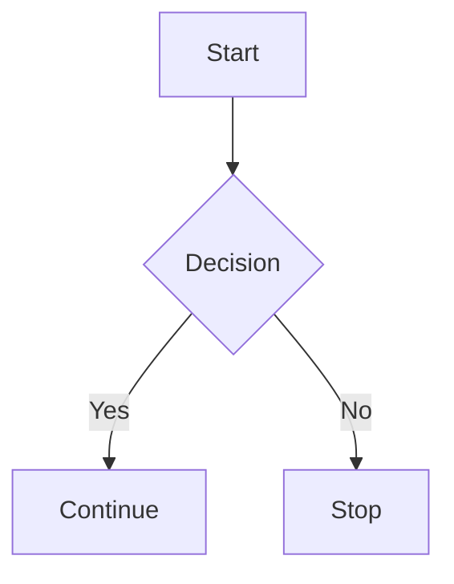
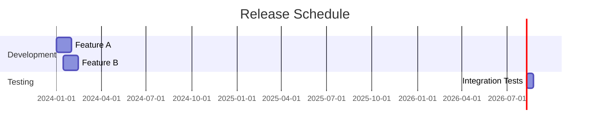
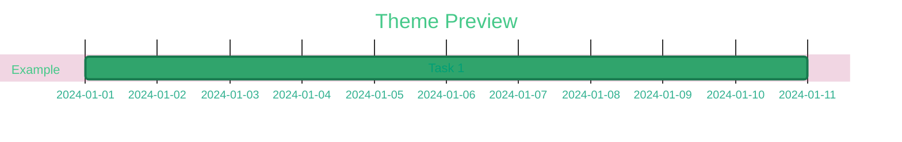

# VitePress Features and Customizations

This guide documents the VitePress features and customizations available for writing Garden Linux documentation. It covers custom components, diagram support, and front-matter extensions.

## Custom Components

Garden Linux documentation includes two custom Vue components that are registered globally in the VitePress theme.

### SectionIndex Component

The `<SectionIndex />` component automatically generates a table of contents for the current documentation section. It reads the sidebar configuration, finds the section matching the current page, and displays its child pages as a grid.

**When to use:**

- On section index pages (e.g., `tutorials/index.md`, `how-to/index.md`)
- Any page that should display links to its child pages

**How it works:**

1. Reads the sidebar configuration from the VitePress theme
2. Finds the sidebar group matching the current directory
3. Extracts child items and their descriptions from front-matter
4. Displays them in a responsive grid layout

**Configuration:**

Use the `overviewDescriptions` front-matter field to control whether child page descriptions are shown:

```yaml
---
title: How-To Guides
overviewDescriptions: true # Show descriptions (default)
---
```

Set to `false` to hide descriptions:

```yaml
---
title: Quick Reference
overviewDescriptions: false # Hide descriptions
---
```

**Example usage:**

```markdown
---
title: How-To Guides
description: Step-by-step guides for common Garden Linux tasks
---

# How-To Guides

How-to guides are **task-oriented** directions that guide you through solving a specific problem or achieving a particular goal. They assume you have some familiarity with Garden Linux and focus on practical solutions.

<SectionIndex />
```

### RelatedTopics Component

The `<RelatedTopics />` component displays a curated list of related documentation pages at the bottom of content. It validates that all linked pages exist during the build process.

**When to use:**

- At the end of content pages
- To guide readers to next steps or related documentation

**How it works:**

1. Reads the `related_topics` array from the page's front-matter
2. Resolves file paths to URLs
3. Extracts titles and descriptions from linked pages
4. Displays them as a formatted list with links

**Configuration:**

Define related topics in the page's front-matter using absolute paths:

```yaml
---
title: Building Images
related_topics:
  - /how-to/choosing-flavors.md
  - /how-to/getting-images.md
  - /reference/features.md
---
```

**Example usage:**

```markdown
---
title: Building Images
description: How to build Garden Linux images
related_topics:
  - /how-to/choosing-flavors.md
  - /how-to/getting-images.md
---

# Building Images

<content here>

<RelatedTopics />
```

## Mermaid Diagrams

Garden Linux documentation supports [Mermaid](https://mermaid.js.org/) diagrams through the `vitepress-mermaid-renderer` plugin. This enables flowcharts, Gantt charts, sequence diagrams, and more.

**When to use:**

- Visualizing timelines and release schedules
- Showing process flows and architectures
- Displaying complex relationships

**How it works:**
The plugin automatically renders code blocks marked with `mermaid` as diagrams. It includes custom theming that matches the Garden Linux brand colors (green scheme) and supports dark mode.

**Syntax:**

````markdown

````

**Gantt chart example:**

````markdown

````

**Custom theming:**
The documentation uses a green color scheme matching Garden Linux branding:



**Real-world example:**
See the [Maintained Releases](../../reference/releases/maintained-releases.md) page for a complete Gantt chart showing release maintenance phases.

## Container Syntax (Callouts)

VitePress supports special container blocks for callouts and highlighted content. Garden Linux documentation uses these throughout.

**When to use:**

- `:::tip` - Recommendations and helpful hints
- `:::warning` - Important caveats or potential issues
- `:::danger` - Critical warnings about data loss, security, etc.
- `:::info` - Informational notes
- `:::details` - Collapsible content for optional information

**Examples:**

```markdown
:::tip
Use rootless Podman for building images. It provides better security
and doesn't require special privileges.
:::

:::warning
Provide at least 8 GiB of memory to the container runtime. Insufficient
memory may cause builds to fail silently.
:::

:::danger
Do not use the production keyring for testing. Always use test keys
to avoid accidentally publishing unverified packages.
:::

:::details Click to expand for technical details
The build process uses the following steps:

1. Initialize container with base image
2. Apply feature layers
3. Apply customization
4. Create final image

Each step creates an intermediate container.
:::

:::info
This feature requires Garden Linux version 2150.0.0 or later.
:::
```

**Best practices:**

- Use `:::tip` for recommendations and best practices
- Use `:::warning` for important caveats
- Use `:::danger` sparingly and only for critical warnings
- Use `:::details` for optional advanced content that most readers don't need

## Front-matter Fields

Garden Linux documentation uses several front-matter fields for configuration.

### Component Configuration

**`overviewDescriptions`** (boolean, default: true)

Controls whether the `<SectionIndex />` component displays descriptions for child pages. Set to `false` on an index page to hide descriptions in its section listing.

**`related_topics`** (array of strings)

Defines related pages for the `<RelatedTopics />` component. Each entry is an absolute file path (starting with `/`) to another markdown file. All paths must exist or the build will fail with an error.

### Display Configuration

**`title`** (string, required)

The page title. Used in navigation, search results, and as the default heading.

**`description`** (string)

A short summary of the page content. Used as the meta description for SEO and displayed by `<SectionIndex />` for child page listings.

**`order`** (number, default: 999)

Controls sort order in the sidebar and section listings. Lower numbers appear first. Use this to create logical groupings (e.g., `0` for intro, `10` for basics, `100` for advanced).

### Aggregated Content Fields

For content aggregated from external repositories, these fields enable proper placement and "Edit on GitHub" links. For complete details on aggregation configuration, see [Documentation Aggregation Configuration Reference](configuration.md).

**`github_target_path`** (string)

Target location in the docs directory for aggregated content.

**`github_org`** (string)

GitHub organization name.

**`github_repo`** (string)

Repository name.

**`github_source_path`** (string)

Original file path in the source repository.

**`github_branch`** (string, default: "main")

Branch name for edit links.

## Best Practices

### Component Usage

- Always use `<SectionIndex />` on section index pages (tutorials/, how-to/, explanation/, reference/)
- Place `<RelatedTopics />` at the end of content pages, before any closing sections
- Keep `related_topics` lists focused (3-5 items is ideal)
- Write clear, concise `description` fields for better section overviews

### Mermaid Diagrams

- Use for timelines, processes, and complex relationships
- Keep diagrams simple and focused
- Test in both light and dark mode (use the preview)
- Don't overuse - diagrams should add clarity, not replace text

### Containers/Callouts

- Use `:::tip` for recommendations and best practices
- Use `:::warning` for important caveats that readers should know
- Use `:::danger` only for critical warnings about data loss, security, or system damage
- Use `:::info` sparingly for contextual information
- Use `:::details` for optional advanced content that most readers can skip

### Front-matter

- Always include `title` and `description` on every page
- Use `order` to control logical flow in sections
- Validate that `related_topics` links exist before committing
- Keep descriptions under 160 characters for optimal SEO

## Related Topics

<RelatedTopics />
